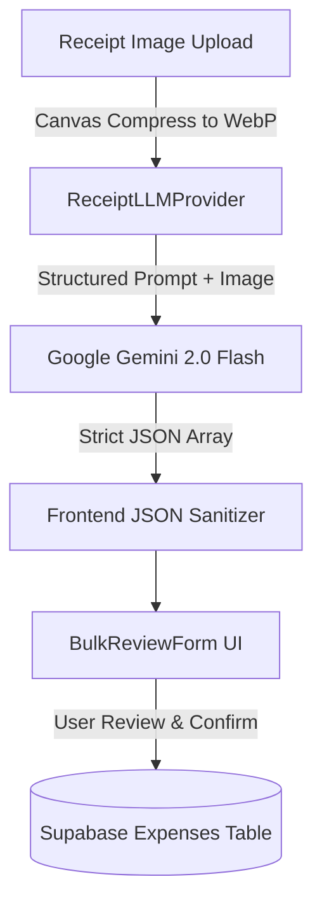

# Financial Management Dashboard

A modern, high-performance personal finance and wealth management platform built with **React**, **Vite**, **Supabase**, and **Google Gemini AI**. Designed with a mobile-first, glassmorphic dark-mode interface, the application bridges the gap between daily expense tracking, predictive budgeting, AI receipt digitization, subscription management, and collaborative financial governance.

---

## 🌟 Core Highlights & Key Features

### 1. 🤖 AI-Powered Receipt Scanner & Extraction
* **Multimodal OCR via Google Gemini:** Instantly digitize paper and digital receipts using Google's Gemini Vision models (`ReceiptLLMProvider`).
* **Drag-and-Drop / Multi-Upload:** Drop receipt images directly into the interface for automated line-item parsing (`Amount`, `Category`, `Date`, `Vendor/Note`).
* **Interactive Bulk Review Form:** Review, modify, or reject AI-parsed items in a batch preview table before committing transactions to the ledger.
* **Resilient Parsing & Smart Fallbacks:** Handles degraded images, foreign currencies, and malformed OCR with clear validation states.

### 2. ⚡ Executive Financial Command Center & Pacing
* **Dynamic Safe-to-Spend & Daily Burn Rate:** Real-time tracking of how fast money is being spent relative to the days remaining in the billing cycle.
* **Predictive Financial Pace (`FinancialPaceCard`):** Compares percentage of time elapsed in the month against budget consumed to forecast end-of-month surplus or deficit.
* **Month-to-Month Carry-Over Momentum:** Under-budget surplus rolls automatically into the next month's effective spending capacity, rewarding disciplined habits.
* **Visual Cumulative Spending Trends:** Interactive area and bar charts tracking actual spending curves against previous months and linear target projections.

### 3. 🔄 Smart Subscription Engine & Skip-Cycle Logic
* **Fixed Cost Burden Tracking:** Computes normalized monthly subscription load with automatic weekly-to-monthly projection multipliers ($4.33\times$).
* **Skip Next Billing Cycle ("Skip Week" / "Skip Month"):** First-class calendar math enabling users to pause recurring costs (e.g., public transit during university breaks or streaming services while traveling) without destroying subscription histories.
* **Leap-Year & Month-End Safe:** Deterministic date arithmetic (`date-fns`) correctly handles 28/29/30/31 day transitions and DST boundaries.
* **30-Day Proactive Renewal Alerts:** Centralized notification feed alerting users before upcoming renewals occur.

### 4. 📊 Multi-Dimensional Spending Analytics
* **3-Tier Analytical Workspace:**
  1. **Overview & Category Health:** Visual progress indicators with configurable category spending caps and threshold breach alerts ($>80\%$ warning, $>100\%$ over budget).
  2. **Time & Day Patterns:** Day-of-week heatmaps and burn velocity curves to identify behavioral spending spikes (e.g., weekend vs. weekday spending).
  3. **Top Expenses & Outlier Insights:** Automated calculation of median transaction sizes, single largest purchase detection, and fixed vs. discretionary spending splits.
* **Custom Time Horizons:** Filter analytics by Current Month, Last 90 Days, Year-to-Date, All-Time, or custom date ranges.

### 5. 🎯 Target-Driven Savings Goals
* **Priority Tiering:** Organize savings goals into High, Medium, and Low priorities with target deadlines and funding bars.
* **Direct Surplus Allocation:** Seamlessly deposit monthly carry-over surplus into specific savings buckets with one click.
* **Incremental Deposit Tracking:** Log dedicated deposits and track real-time goal completion percentages.

### 6. 💼 Flexible Income & Budget Builder
* **Multi-Stream Income Modeling:** Calculate total monthly budget using a combination of:
  * Fixed Base Monthly Budget
  * Salary Allocation
  * Part-Time Hourly Wage Calculator ($\text{Hours} \times \text{Hourly Rate}$)
* **Custom Category Limits:** Set and adjust spending caps for individual categories with interactive search and instant persistence.
* **Multi-Currency Support:** Format balances and transactions in NZD, USD, EUR, GBP, AUD, and more with locale-aware precision.

### 7. 👥 Collaborative Budgets & Role-Based Access Control (RBAC)
* **Owner:** Full administrative authority (CRUD expenses, subscriptions, goals, and income settings).
* **Reviewer (Advisor / Partner Mode):** Can view ledgers, leave contextual comments on specific expense items, and author monthly financial review summaries.
* **Viewer:** Read-only dashboard access.
* **Secured with Supabase RLS:** Row-Level Security ensures strict multi-tenant isolation and collaborative data sharing.

### 8. 📱 Mobile-First Glassmorphic Design System
* **Mobile-First UX Strategy:** Optimized specifically for one-handed mobile use on iPhone screens with high-density, touch-friendly row views that eliminate scroll fatigue, expanding into detailed analytical layouts on desktop.
* **Sleek Dark Mode Aesthetics:** Deep slate background with frosted glass cards (`backdrop-blur`), vibrant accent glows, and smooth transitions powered by **Framer Motion** and **Tailwind CSS**.

---

## 🏗️ Architecture & Project Structure

```
financial-management/
├── src/
│   ├── components/
│   │   ├── auth/           # Authentication guards & sign-in modal
│   │   ├── breakdown/      # Category tables, health cards, day-of-week & trend charts
│   │   ├── comments/       # Reviewer comment threads & drawer
│   │   ├── common/         # States (Empty, Loading, Error) & shared components
│   │   ├── dashboard/      # BalanceHero, PaceCard, MonthlyChart, Widgets
│   │   ├── expenses/       # AI ReceiptScanner, BulkReviewForm, ExpenseForm
│   │   ├── shell/          # AppShell, Topbar, Sidebar navigation
│   │   ├── subscriptions/  # Subscription cards, detail modal & add modal
│   │   └── ui/             # Reusable forms, custom date pickers, popovers
│   ├── hooks/              # Custom data hooks (useCarryOver, useSubscriptions, useSavingsGoals, etc.)
│   ├── lib/                # Supabase client & Google Gemini LLM provider
│   ├── pages/              # Dashboard, Breakdown, Subscriptions, Savings, Settings, Notifications, Investments
│   ├── styles/             # Design tokens & global glassmorphism CSS
│   ├── tests/              # Regression tests (finance calculations, skip-billing contracts, LLM)
│   └── utils/              # Math utilities, date calculations, subscription engine
├── public/                 # Static assets & icons
├── tooling/                # Agent skills registry, guidelines, and automation tools
├── package.json            # Scripts & project dependencies
└── vite.config.js          # Vite build and plugin configuration
```

---

## 🛠️ Tech Stack

| Domain | Technology |
|---|---|
| **Frontend Framework** | [React 18](https://react.dev/) + [Vite](https://vitejs.dev/) |
| **Routing** | [React Router v7](https://reactrouter.com/) |
| **Styling & Design System** | [Tailwind CSS](https://tailwindcss.com/) + Custom CSS Design Tokens |
| **Animations & Transitions** | [Framer Motion](https://www.framer.com/motion/) |
| **Charts & Data Visualization** | [Recharts](https://recharts.org/) |
| **Icons & UI Primitives** | [Lucide React](https://lucide.dev/) + [Radix UI](https://www.radix-ui.com/) + [React Day Picker](https://daypicker.dev/) |
| **AI / Multimodal OCR** | [Google Generative AI SDK](https://www.npmjs.com/package/@google/generative-ai) (`@google/generative-ai`) |
| **Backend & Database** | [Supabase](https://supabase.com/) (PostgreSQL, Row Level Security, Realtime Auth) |
| **Date & Time Utilities** | [date-fns](https://date-fns.org/) |

---

## 🚀 Getting Started

### Prerequisites
* [Node.js](https://nodejs.org/) (v18 or higher recommended)
* A [Google Gemini API Key](https://aistudio.google.com/) (for receipt scanning)
* A [Supabase Project](https://supabase.com/) (for authentication, relational database, and RLS)

### Installation

1. **Clone the repository:**
   ```bash
   git clone <repository-url>
   cd "financial management"
   ```

2. **Install dependencies:**
   ```bash
   npm install
   ```

3. **Configure Environment Variables:**
   Create a `.env` file in the root directory:
   ```env
   VITE_GEMINI_API_KEY=your_google_gemini_api_key
   VITE_SUPABASE_URL=your_supabase_project_url
   VITE_SUPABASE_ANON_KEY=your_supabase_anon_key
   ```

4. **Start the Development Server:**
   ```bash
   npm run dev
   ```
   Open your browser at `http://localhost:5173`.

---

## 🧪 Testing & Verification

The project includes an automated test suite verifying financial math, date-edge cases, subscription pause cycles, and AI OCR contracts:

```bash
# Run all core regression test suites
npm run test

# Run skip-billing-cycle source-of-truth tests (46 assertions)
npm run test:skip-billing

# Run finance metrics & goal progress calculations test suite
npm run test:finance

# Run AI receipt scanner LLM extraction tests
npm run test:llm
```

---

## 💡 AI Receipt Scanner & Ingestion Architecture

### 1. Direct In-App Scanner (Synchronous)
Used when uploading receipts directly in the web app for immediate in-browser preview:


### 2. Architecture Decision Record (ADR): Decoupled Asynchronous Agent Ingestion
* **Status**: Accepted
* **Context**:
  1. **GitHub Pages Client Isolation**: The web app is hosted on GitHub Pages (static hosting). Running LLM OCR in-browser requires baking API keys into public JS bundles or dealing with mobile timeout drops.
  2. **Mobile Speed ("Snap & Forget")**: Taking a receipt photo on an iPhone at checkout must be instantaneous (<2 seconds) without waiting 15 seconds for OCR processing on cellular data.
  3. **Storage Quotas**: Supabase free tier provides 1GB of storage. Retaining 3–8 MB iPhone photos indefinitely causes quota pressure.
  4. **MCP Protocol Constraints**: Standard Supabase MCP servers (`@supabase/mcp-server-supabase`) support PostgreSQL SQL queries, but lack binary object storage streaming tools. Streaming large Base64 image payloads over MCP JSON-RPC floods LLM context windows.
* **Decision**:
  Decouple the pipeline into **Client Canvas Compression & 2-Phase Queue**, **Lightweight I/O Fetcher Script**, **Native Agent Vision Cognition**, and **Immediate Storage Auto-Purge**:
  ```mermaid
  sequenceDiagram
      actor User as iPhone Web App
      participant Storage as Supabase Storage (receipts)
      participant DB as Supabase DB (receipt_queue)
      participant Fetcher as tooling/scripts/fetch-receipts.js
      participant Agent as Antigravity Agent (7–9 PM Active Window)
      participant Committer as tooling/scripts/commit-receipt.js

      User->>Storage: 1. Upload compressed WebP (~250KB)
      User->>DB: 2. Insert receipt_queue (status: 'pending')
      Agent->>Fetcher: 3. Run fetcher script
      Fetcher->>Storage: 4. Download binary to local scratch/receipts/
      Agent->>Agent: 5. Inspect image with native vision (view_file)
      Agent->>Committer: 6. Commit extracted JSON
      Committer->>DB: 7. Update status to 'ready_for_review'
      Committer->>Storage: 8. PURGE image from cloud storage (0 MB retained!)
      User->>DB: 9. 1-Tap 'Approve All' on Mobile Dashboard
  ```
* **Key Benefits**:
  - **Zero Storage Creep**: Receipt images are purged from Supabase Storage the instant data is extracted into the review queue.
  - **Zero Token Bloat**: Images reside in local scratch files where the Antigravity agent inspects them via native multimodal vision (`view_file`), avoiding 400,000+ base64 characters in MCP stdio streams.
  - **Effortless Mobile Review**: Extracted items appear in a 1-tap approval banner at the top of the mobile dashboard, eliminating scroll fatigue.

---

## 🔮 Roadmap & Upcoming Features

- [ ] **Investments & Portfolio Tracking:** Live stock quotes, crypto asset balances, and portfolio risk analysis.
- [ ] **Bank Feed Sync (Open Banking):** Automated transaction syncing via Plaid / Akahu.
- [ ] **Multi-Currency Auto Conversion:** Real-time exchange rate normalization for international travel and remote income.
- [ ] **Export & Tax Reporting:** One-click CSV/PDF statement export for tax accounting.

---

## 📄 License

This project is licensed under the MIT License.
