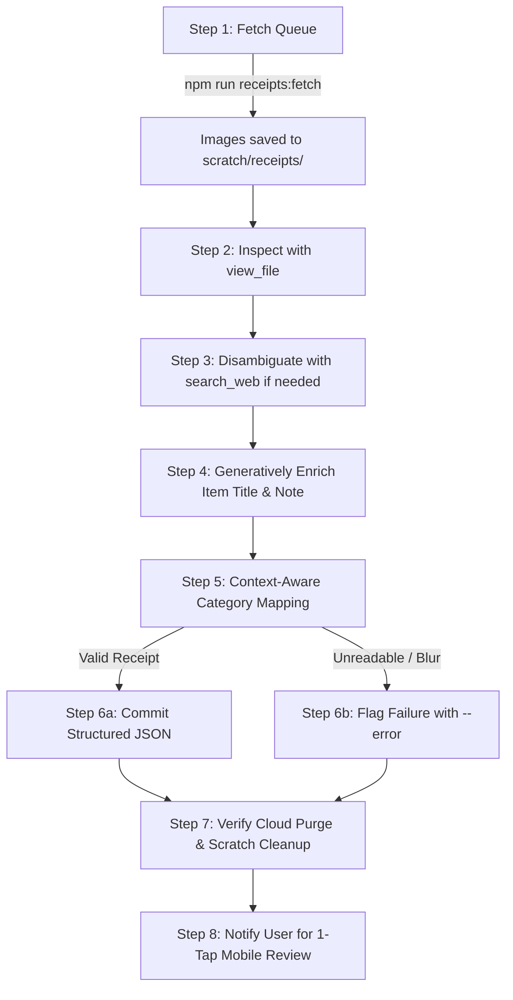

# Agent Receipt Ingestion & Review Queue Workflow

> **Source**: Project Custom Guide (`work/plans/scheduled-receipt-processor.md`)
> **Use when**: User asks to fetch/process receipts from the queue, or when executing a scheduled receipt ingestion session.
> **Load Priority**: High (for any receipt queue processing task)

---

## 🎯 Purpose & Overview

This workflow defines the standard operating procedure (SOP) for an AI agent to ingest, visually inspect, intelligently enrich, categorize, and commit pending receipts uploaded from mobile clients.

### The Generative Agent Philosophy: Intelligence Beyond Raw OCR
A simple optical character recognition (OCR) script blindly copies truncated, cryptic print text (e.g. `^ Essano Blood Orange Bodywash 900ml`, `SIG PB CRUNCHY 375G`, `WW BBD CHK THIGH`). 

As a **generative AI agent**, your role is to deliver high-utility, beautifully contextualized financial records:
1. **Expand and clarify**: Decrypt cryptic abbreviations into clean, human-readable product names.
2. **Web-search disambiguation**: When an item code, supermarket acronym, or obscure brand is ambiguous, use `search_web` to discover the exact product, full brand name, and pack size.
3. **Contextual enrichment**: Enrich the `note` field with product type, usage, branch location, or promo/savings context instead of leaving duplicate or empty strings.
4. **Context-aware categorization**: Recognize that supermarkets sell groceries, personal care (`Health`), household gear (`Shopping`), and prepared lunch meals (`Food`) on a single docket.

---

## 📋 End-to-End Execution Checklist



---

## 🚀 Step-by-Step Instructions

### Step 1: Fetch Pending Receipts from Queue

Run the fetch command from the repository root:

```bash
npm run receipts:fetch
```
*(Or specify options: `node tooling/scripts/fetch-receipts.js --limit=5` or `--id=<uuid>`)*

**What this does**:
- Queries `public.receipt_queue` in Supabase for `status = 'pending'`.
- Downloads original compressed WebP images from the private `receipts` Supabase bucket.
- Saves files locally to `scratch/receipts/{receiptId}.webp`.
- Automatically transitions queue status to `'processing'`.
- Outputs a JSON manifest containing the list of downloaded files.

*Example Output*:
```json
{
  "message": "Successfully fetched 1 receipts to scratch/receipts/.",
  "receipts": [
    {
      "id": "7c9bc63a-e966-4aa7-a760-643bbc6eff8e",
      "userId": "766ca3c6-241b-47e4-bc65-13378c97bcd3",
      "filePath": "766ca3c6-241b-47e4-bc65-13378c97bcd3/7c9bc63a-e966-4aa7-a760-643bbc6eff8e.webp",
      "localPath": "scratch/receipts/7c9bc63a-e966-4aa7-a760-643bbc6eff8e.webp",
      "absoluteLocalPath": "/absolute/path/to/scratch/receipts/{id}.webp",
      "sizeBytes": 113240
    }
  ]
}
```

If `receipts: []`, report to the user that the queue is empty and stop.

---

### Step 2: Multimodal Image Inspection

Inspect the downloaded image using the agent's native multimodal tool:

```
Tool: view_file
AbsolutePath: <absoluteLocalPath from step 1>
```

Carefully examine the image for:
1. **Merchant / Store Name & Branch**: Look at the top header (e.g., *Woolworths Chartwell, Hamilton*, *Pak'nSave Moorhouse*, *Bunnings Te Rapa*).
2. **Transaction Date**: Usually printed near the receipt number, EFTPOS slip, or footer. Format as `YYYY-MM-DD`. Convert two-digit years (e.g. `16/09/26`) to 4-digit ISO (`2026-09-16`).
3. **Itemized Lines & Discounts**: Individual products, quantities, unit prices, member discounts, and final charged line amounts.
4. **Final Total Paid**: Total charge on card or cash.

---

### Step 3: Generative Enrichment, Web Search & Taxonomy Mapping

#### 3.1 The "Anti-Naive" Rule
**Never blindly copy raw truncated text or cryptic receipt codes verbatim.**
Receipt printers truncate product names to fit 24–32 characters, using extreme contractions, department codes, or cryptic acronyms (e.g. `^ Essano Blood Orange Bodywash 900ml`, `SIG PB CRUNCHY 375G`, `WW BBD CHK THG`, `F&V AVOCADO HASS`). 

Generative agents must expand and reformat them into clear, professional, human-readable titles in title case.

#### 3.2 Web Search for Disambiguation (`search_web`)
When an item description is cryptic, ambiguous, or only provides a store code / SKU / truncated brand:
- Use `search_web`:
  - `query: "Woolworths NZ Essano Blood Orange 900ml"`
  - `query: "PaknSave Pams SKU 941234567"`
  - `query: "Signature Range peanut butter crunchy 375g"`
- Find the exact product, full brand name, flavor/scent variant, pack size, and package type (e.g., pump bottle, refill pouch, can, box).

#### 3.3 Data Enrichment Protocol: Distinct `item` vs `note`
In the user's mobile review drawer and ledger, `item` and `note` serve distinct functions:
- **`item` (or `name`)**: Clean, descriptive, human-readable product title with key specs (e.g. `Essano Blood Orange Hydrating Body Wash (900ml)`).
- **`note`**: Rich descriptive metadata that gives financial context:
  - Product classification / usage (e.g. `Moisturising body wash / personal care`).
  - Store branch context (e.g. `Woolworths Chartwell`).
  - Promo / member savings info if present on docket (e.g. `$6.00 Everyday Rewards savings`).

#### 3.4 Context-Aware Category Disambiguation
Supermarket dockets often combine products belonging to completely different spending categories:

| Purchased Item | Naive Category | Generative AI Category | Rationale |
|---|---|---|---|
| Shower Gel / Shampoo / Deodorant | `Groceries` | **`Health`** | Personal care, hygiene, and wellness |
| Fresh Produce / Milk / Bread | `Food` | **`Groceries`** | Standard supermarket pantry & cooking supplies |
| Hot Rotisserie Chicken / Sushi / Deli Roll | `Groceries` | **`Food`** | Ready-to-eat meal / dining |
| Kitchen Frying Pan / Wine Glasses | `Groceries` | **`Shopping`** | Durable home/kitchenware |
| Household Bleach / Dishwasher Tablets | `Other` | **`Groceries`** | Routine household maintenance supplies |
| Prescription / Painkillers / Vitamins | `Groceries` | **`Health`** | Medicine and pharmacy |

**Full Allowed Category Taxonomy**:
- `Food` (Dining out, takeout, cafes, fast food, ready-to-eat deli meals)
- `Groceries` (Supermarket food, pantry staples & routine household supplies)
- `Transport` (Fuel, public transit, parking, rideshare)
- `Entertainment` (Cinema, games, hobbies, streaming)
- `Shopping` (Clothing, electronics, hardware, general retail, home goods)
- `Bills` (Utilities, rent, internet, recurring subscriptions)
- `Health` (Pharmacy, doctor, gym, personal care & hygiene)
- `Education` (Books, courses, tuition)
- `Other` (Default fallback)

#### 3.5 Comparison: Naive OCR vs. Smart Generative Extraction

| Field | ❌ Naive OCR Agent | ✅ Smart Generative Agent |
|---|---|---|
| **Vendor** | `WOOLWORTHS` | `Woolworths Chartwell` |
| **Line Item Title** | `^ Essano Blood Orange Bodywash 900ml` | `Essano Blood Orange Hydrating Body Wash (900ml)` |
| **Line Item Note** | `^ Essano Blood Orange Bodywash 900ml` *(duplicate)* | `Moisturising body wash / personal care • Woolworths Chartwell ($6.00 Everyday Rewards savings)` |
| **Category** | `Groceries` *(generic)* | `Health` *(accurate personal care)* |
| **Total** | `10.99` | `10.99` |

---

### Step 4: Commit Extraction Back to Database

#### Case A: Successful Extraction
Run `commit-receipt.js` passing the JSON via `--data`:

```bash
node tooling/scripts/commit-receipt.js \
  --id="<receiptId>" \
  --data='{"vendor":"Woolworths Chartwell","date":"2026-09-16","total":10.99,"items":[{"item":"Essano Blood Orange Hydrating Body Wash (900ml)","name":"Essano Blood Orange Hydrating Body Wash (900ml)","note":"Moisturising body wash / personal care • Woolworths Chartwell ($6.00 Everyday Rewards savings)","amount":10.99,"category":"Health","date":"2026-09-16"}]}'
```

*Or save to a scratch JSON file if escaping complex characters in bash*:
```bash
node tooling/scripts/commit-receipt.js --id="<receiptId>" --file="scratch/receipts/<receiptId>.json"
```

#### Case B: Unreadable or Corrupt Image
If the image is completely unreadable, blurry, or not a receipt, flag it with `--error`:
```bash
node tooling/scripts/commit-receipt.js \
  --id="<receiptId>" \
  --error="Image is too blurry to distinguish line items."
```

---

### Step 5: Verification of Lifecycle Commit

The commit script will output:
```json
{
  "success": true,
  "receiptId": "7c9bc63a-e966-4aa7-a760-643bbc6eff8e",
  "status": "ready_for_review",
  "itemsExtracted": 1,
  "total": 10.99,
  "storagePurged": true,
  "storagePurgeError": null,
  "localCleaned": true,
  "message": "Receipt committed successfully. Ready for 1-tap mobile review."
}
```

Verify the following:
1. `status === "ready_for_review"`: Row updated in `receipt_queue`.
2. `storagePurged === true`: Original image file deleted from Supabase Storage (0 MB cloud storage creep!).
3. `localCleaned === true`: Local file deleted from `scratch/receipts/` (zero disk bloat).

---

### Step 6: Notify User for 1-Tap Mobile Review

Conclude by informing the user of the enriched receipt details:
- **Merchant & Location**
- **Date**
- **Itemized Breakdown** showing the expanded item title, contextual note, assigned category, and price
- Mention that the receipt is now ready for **1-Tap Quick Approval** in the mobile `ReceiptReviewBanner` on iPhone.
