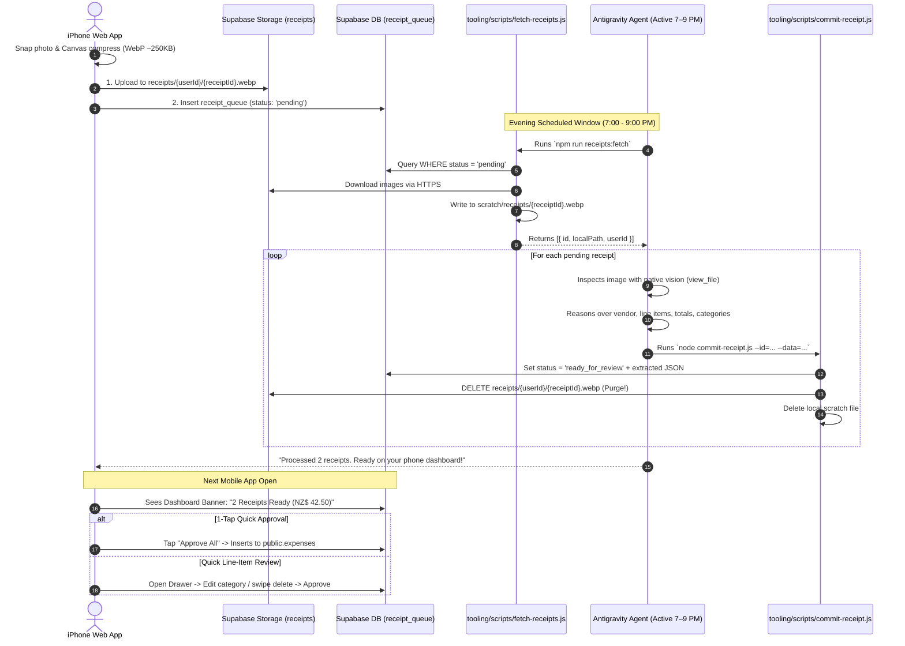

# Implementation Plan: Decoupled Agent Receipt Ingestion & Effortless Mobile Review

This plan details the architecture and implementation for an **Agent-in-the-Loop** receipt ingestion pipeline. It solves client-side OCR limitations on GitHub Pages, eliminates Supabase free-tier storage creep (0 MB retained), and optimizes the mobile review experience for fast 1-tap approvals.

---

## Architecture Decision Record (ADR) Summary

* **Decision**: Decouple the receipt pipeline into **Lightweight I/O Scripts** (network transfer & storage lifecycle) and **Native Agent Cognition** (multimodal vision, categorization, and line-item reasoning), coordinated through a Supabase queue (`receipt_queue`).
* **Why Script I/O Beats Direct MCP for Images**:
  1. Standard Supabase MCP only covers SQL/database operations and has no storage download tools.
  2. Passing binary images through MCP requires Base64 text streaming (~400,000 chars per photo), which pollutes LLM context windows and increases latency.
  3. Downloading directly to local disk (`scratch/receipts/`) allows the agent to inspect the file via native multimodal vision (`view_file`) with zero token bloat and enables instant local debugging.
* **Storage Lifecycle**: Images are automatically deleted from Supabase Storage the instant the agent extracts the data and queues it for review (guaranteeing 0% storage creep on the 1GB free tier).

---

## 1. End-to-End System Workflow

---

## 2. Component Specifications

### 2.1 Storage & Queue Layer (`supabase/migrations/009_receipt_storage_and_queue.sql`)
- **Bucket**: `receipts` (private, 5MB file limit, MIME types: `image/webp`, `image/jpeg`, `image/png`).
- **Storage RLS**: Authenticated users can insert/select/delete objects in their own folder `(storage.foldername(name))[1] = auth.uid()::text`.
- **Table**: `public.receipt_queue`:
  - `id uuid primary key`
  - `user_id uuid references auth.users(id)`
  - `file_path text not null`
  - `status text default 'uploading' check (status in ('uploading', 'pending', 'processing', 'ready_for_review', 'completed', 'failed'))`
  - `extracted_data jsonb`
  - `error_message text`
  - `created_at timestamptz default now()`
  - `processed_at timestamptz`

### 2.2 Client-Side Compression & Upload (`src/utils/imageCompression.js` & `useReceiptUploader.js`)
- **Canvas Resizer**: Clamps longest dimension to `1600px`, encodes as `image/webp` at `0.82` quality. Reduces file size from 5–10MB down to ~250KB without any OCR text degradation.
- **Two-Phase Handshake**:
  1. Insert row with `status = 'uploading'`.
  2. Upload image to Supabase Storage.
  3. Update row to `status = 'pending'`.
  4. Auto-rollback: Delete DB row if upload fails; delete storage file if DB update fails.

### 2.3 Agent Tooling (Separation of Concerns)
- **`tooling/scripts/fetch-receipts.js`** (I/O):
  - Uses `SUPABASE_SERVICE_ROLE_KEY` to query pending queue rows.
  - Downloads binary blobs from Supabase Storage and saves to `scratch/receipts/{receiptId}.webp`.
  - Outputs a JSON manifest of downloaded files for the agent.
- **Agent Multimodal Cognition**:
  - Agent calls `view_file` on `scratch/receipts/{receiptId}.webp`.
  - Identifies vendor, transaction date, currency, line items, and categorizes using project taxonomy (`Food`, `Groceries`, `Transport`, `Entertainment`, `Shopping`, `Bills`, `Health`, `Education`, `Other`).
- **`tooling/scripts/commit-receipt.js`** (Persistence & Purge):
  - Saves the structured JSON into `receipt_queue.extracted_data` with `status = 'ready_for_review'`.
  - Calls `supabase.storage.from('receipts').remove([filePath])` to immediately free cloud storage.
  - Removes the local scratch file.

### 2.4 Mobile "Need+Review" UX (`ReceiptReviewBanner.jsx` & `ReceiptReviewDrawer.jsx`)
- **Banner (Top of Dashboard)**:
  - Displays summary: `🧾 2 Receipts Ready (NZ$ 42.50)`.
  - Primary button: `Approve All (1-Tap)` — instantly writes rows to `public.expenses` and marks queue items `'completed'`.
  - Secondary button: `Review`.
- **Drawer (5-Second Detailed Review)**:
  - Touch-friendly, high-density row view minimizing scrolling on iPhone.
  - Receipt thumbnail preview with zoom modal.
  - Instant category pill switchers (horizontal scrollable chips: `[Groceries] [Food] [Transport]`).
  - Swipe or tap `✕` to drop false positive lines.
  - Bottom sticky button: `Confirm & Add to Ledger`.

---

## Proposed Code Changes

### Branch: `feat/scheduled-receipt-processor`

#### Database
- [NEW] [009_receipt_storage_and_queue.sql](file:///Users/letanthang/learning_software/financial%20mangement/supabase/migrations/009_receipt_storage_and_queue.sql)

#### Client Core & Compression
- [NEW] [imageCompression.js](file:///Users/letanthang/learning_software/financial%20mangement/src/utils/imageCompression.js)
- [NEW] [useReceiptUploader.js](file:///Users/letanthang/learning_software/financial%20mangement/src/hooks/useReceiptUploader.js)

#### Mobile UI Components
- [NEW] [ReceiptReviewBanner.jsx](file:///Users/letanthang/learning_software/financial%20mangement/src/components/expenses/ReceiptReviewBanner.jsx)
- [NEW] [ReceiptReviewDrawer.jsx](file:///Users/letanthang/learning_software/financial%20mangement/src/components/expenses/ReceiptReviewDrawer.jsx)
- [MODIFY] [App.jsx](file:///Users/letanthang/learning_software/financial%20mangement/src/App.jsx) (Mount review banner in dashboard)
- [MODIFY] [ExpenseForm.jsx](file:///Users/letanthang/learning_software/financial%20mangement/src/components/expenses/ExpenseForm.jsx) (Add quick "Snap & Queue" button)

#### Agent CLI Scripts
- [NEW] [fetch-receipts.js](file:///Users/letanthang/learning_software/financial%20mangement/tooling/scripts/fetch-receipts.js)
- [NEW] [commit-receipt.js](file:///Users/letanthang/learning_software/financial%20mangement/tooling/scripts/commit-receipt.js)
- [MODIFY] [package.json](file:///Users/letanthang/learning_software/financial%20mangement/package.json) (Add `receipts:fetch` & `receipts:commit` npm scripts)

#### Documentation
- [MODIFY] [README.md](file:///Users/letanthang/learning_software/financial%20mangement/README.md) (Add ADR section detailing the decoupled architecture)

---

## Verification Plan

### Automated Tests
- Run `node src/tests/compression.test.js` to verify Canvas WebP compression (size, aspect ratio, quality).
- Run mock lifecycle test on `fetch-receipts.js` and `commit-receipt.js` to verify file download, JSON injection, storage purge, and scratch cleanup.

### Manual Verification
1. On iPhone (or responsive view), snap a photo using "Snap & Queue" -> verify file uploads to Supabase Storage and `receipt_queue` records `pending`.
2. Run `npm run receipts:fetch` -> verify image appears in `scratch/receipts/`.
3. Agent inspects file with `view_file` and executes `commit-receipt.js`.
4. Verify Supabase Storage object is immediately purged (0 MB used).
5. Open mobile dashboard -> verify `ReceiptReviewBanner` displays extracted total.
6. Tap `Approve All (1-Tap)` -> verify items appear in `public.expenses`.
